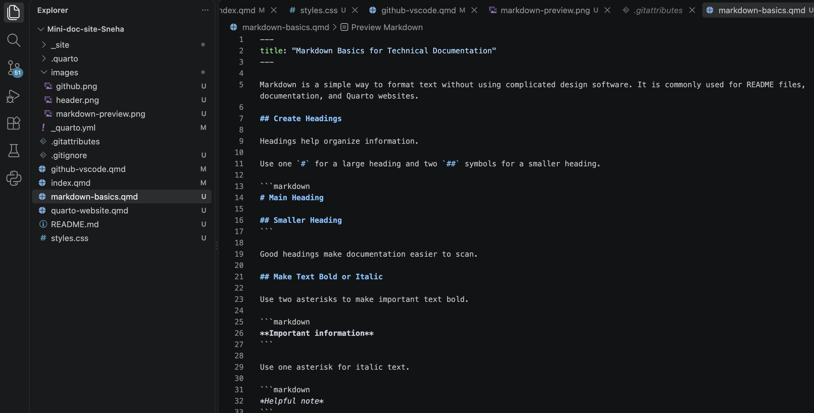

Markdown is a simple way to format text without using complicated design software. It is commonly used for README files, documentation, and Quarto websites.

## Create Headings

Headings help organize information.

Use one `#` for a large heading and two `##` symbols for a smaller heading.

```markdown
# Main Heading

## Smaller Heading
```

Good headings make documentation easier to scan.

## Make Text Bold or Italic

Use two asterisks to make important text bold.

```markdown
**Important information**
```

Use one asterisk for italic text.

```markdown
*Helpful note*
```

## Create Lists

Use hyphens for bullet lists:

```markdown
- First item
- Second item
- Third item
```

Use numbers when readers need to follow steps in order:

```markdown
1. Open VS Code.
2. Create a file.
3. Save the file.
```

## Add Links

Links help readers find more information.

A Markdown link looks like this:

```markdown
[Visual Studio Code](https://code.visualstudio.com/)
```

## Add Images

Images use similar syntax:

```markdown

```

The words inside the square brackets are called **alt text**. Alt text describes the image for people who cannot see it.



## Preview Markdown

VS Code can show a preview of a Markdown document. Open a Markdown file and use the preview command to compare the source text with the formatted result.

Markdown keeps the source file simple while still allowing you to create organized and readable documentation.