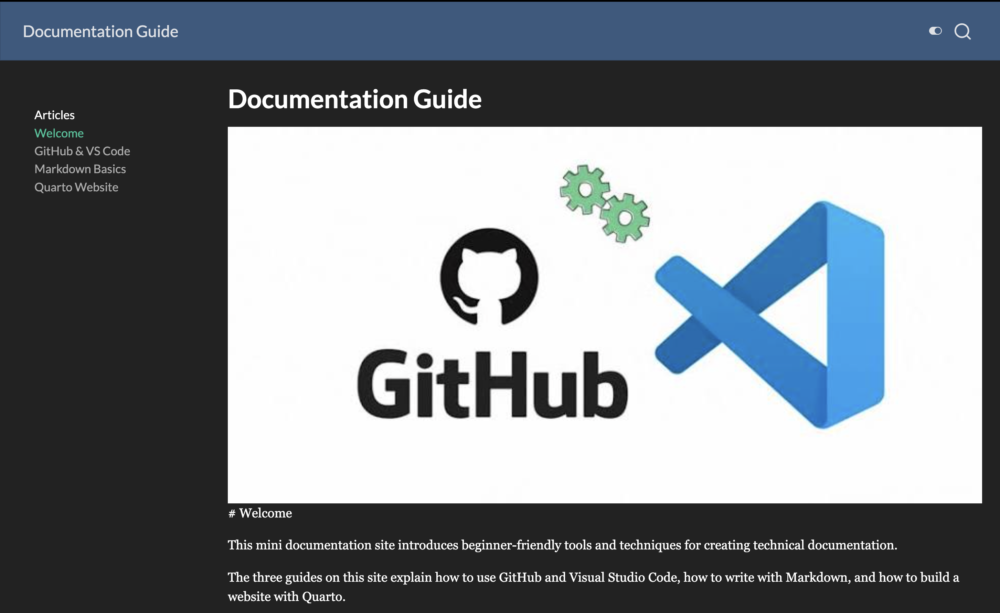

Quarto is a publishing tool that can turn Markdown-based files into websites. Instead of writing every HTML page by hand, you write your content in `.qmd` files and let Quarto create the web pages.

## Check That Quarto Is Installed

Open the terminal in Visual Studio Code.

Type:

```bash
quarto --version
```

If Quarto is installed correctly, the terminal will display a version number.

## Create Quarto Pages

Quarto pages usually use the `.qmd` file extension.

For example:

```text
index.qmd
markdown-basics.qmd
quarto-website.qmd
```

The `index.qmd` file normally becomes the home page of the website.

## Preview the Website

Open the terminal in the main project folder.

Run:

```bash
quarto preview
```

Quarto will build the website and open a preview in your browser.



Keep the preview open while editing. When you save a file, Quarto can update the preview.

## Stop the Preview

Go back to the VS Code terminal.

Press:

```text
Ctrl + C
```

This stops the preview server.

## Render the Website

When the site is ready, run:

```bash
quarto render
```

Quarto creates the finished HTML files for the website.

The generated website normally appears inside a folder called `_site`.

## Publish the Site

After checking the rendered website, the project can be uploaded to GitHub and published with GitHub Pages.

Quarto allows the source content to remain separate from the final HTML website, which makes the project easier to edit and maintain.